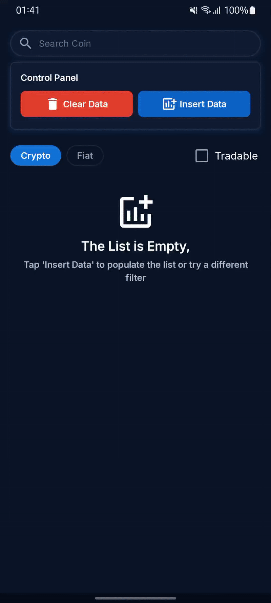
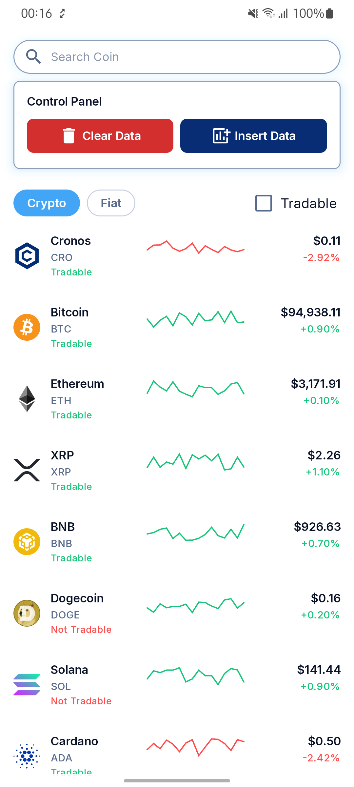
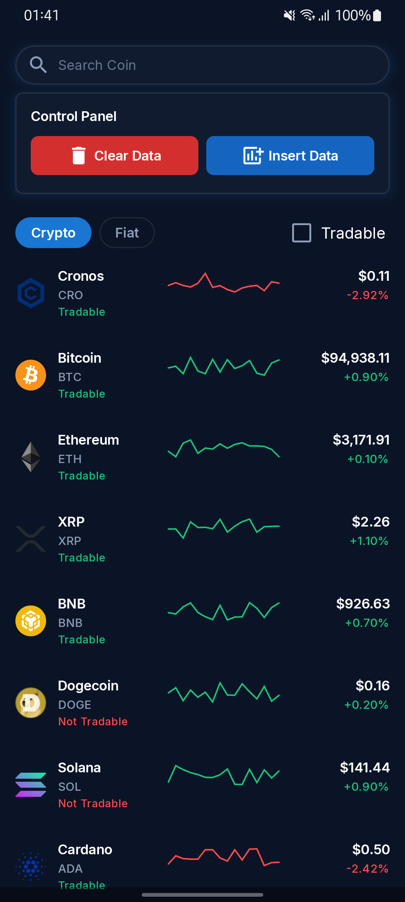
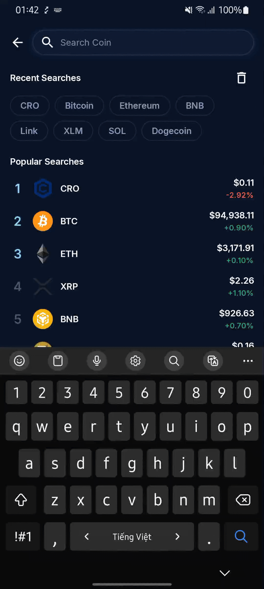
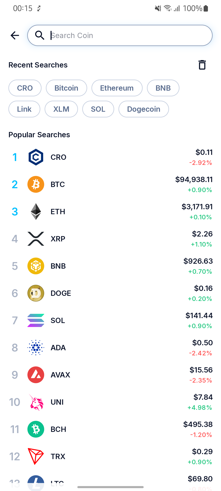
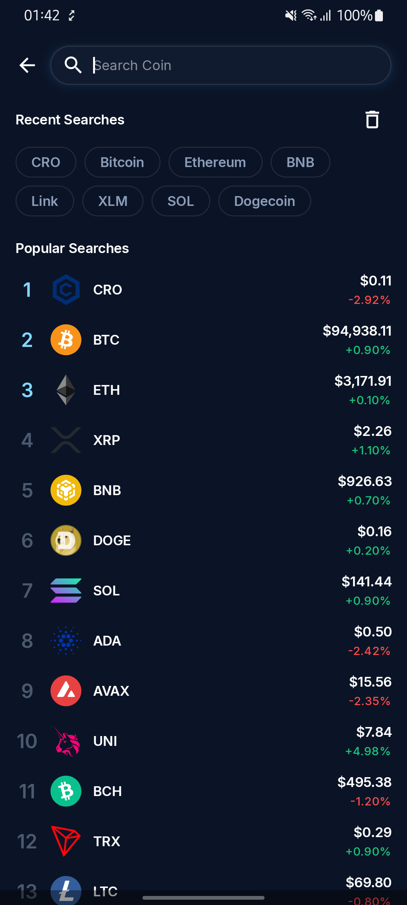
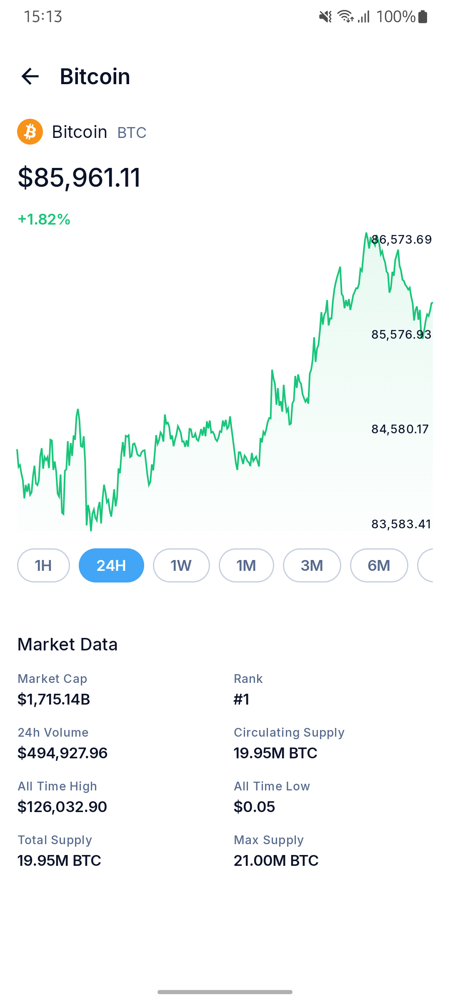
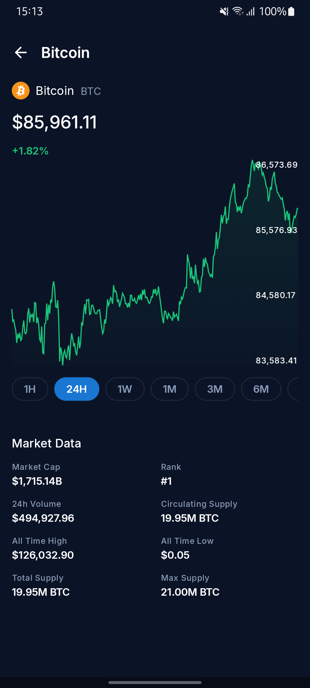

# Cryptome – Android App [](https://github.com/tranhuuluong/cryptome/actions/workflows/main.yml)

## 📄 Overview

Cryptome is a modern, modular Android application built with 100% **Jetpack Compose**.  
It showcases clean architecture, reactive state management, and a scalable multi-module structure.

This project also includes a custom **build-logic** module for shared Gradle configurations and a **GitHub Actions** workflow that runs linting, testing, and APK builds, helping maintain code quality as the app grows.

---

## 📚 Table of Contents
- [Overview](#-overview)
- [Features](#-features)
- [Screenshots](#screenshots)
- [Tech Stack](#-tech-stack)
- [Architecture & Module Structure](#-architecture--module-structure)

## 🚀 Features
- View crypto/fiat currencies with price, percentage change, and sparkline charts
- Toggle between Crypto and Fiat, “Tradable / Not Tradable” status indicators
- Control Panel for quick actions (Insert Data, Clear Data)
- Real-time search with recent and popular queries
- Detailed coin information with animated price chart build using custom Canvas drawings
- Light and Dark theme support

## Screenshots:
<table>
  <tr>
    <td align="center"><b>Home – Interaction Demo</b></td>
    <td align="center"><b>Home – Light Mode</b></td>
    <td align="center"><b>Home – Dark Mode</b></td>
  </tr>
  <tr>
    <td width="33%">
      
    </td>
    <td width="33%">
      
    </td>
    <td width="33%">
      
    </td>
  </tr>

  <tr>
    <td align="center"><b>Search – Interaction Demo</b></td>
    <td align="center"><b>Search – Light Mode</b></td>
    <td align="center"><b>Search – Dark Mode</b></td>
  </tr>
  <tr>
    <td width="33%">
      
    </td>
    <td width="33%">
      
    </td>
    <td width="33%">
      
    </td>
  </tr>

  <tr>
    <td align="center"><b>Coin Detail – Interaction Demo</b></td>
    <td align="center"><b>Coin Detail – Light Mode</b></td>
    <td align="center"><b>Coin Detail – Dark Mode</b></td>
  </tr>
  <tr>
    <td width="33%">
      
    </td>
    <td width="33%">
      
    </td>
    <td width="33%">
      
    </td>
  </tr>

</table>

## 🛠 Tech Stack
[](https://developer.android.com/jetpack/compose)
[](https://developer.android.com/jetpack/androidx/releases/compose-material3)
[](https://developer.android.com/jetpack/compose/navigation)
[](https://insert-koin.io/)
[](https://ktor.io/)
[](https://developer.android.com/jetpack/androidx/releases/room)
[](https://github.com/Kotlin/kotlinx.coroutines)
[](https://developer.android.com/kotlin/flow)
[](https://github.com/cashapp/turbine)
[](https://mockk.io/)
[](https://robolectric.org/)
[](https://github.com/features/actions)
[](#)

- **UI**: [Jetpack Compose](https://developer.android.com/jetpack/compose), [Material 3](https://developer.android.com/jetpack/androidx/releases/compose-material3), [Compose Navigation](https://developer.android.com/jetpack/compose/navigation)
- **DI**: [Koin](https://insert-koin.io/)
- **Networking**: [Ktor](https://ktor.io/)
- **Database**: [Room](https://developer.android.com/jetpack/androidx/releases/room)
- **Async**: [Coroutines](https://github.com/Kotlin/kotlinx.coroutines) + [Flow](https://developer.android.com/kotlin/flow)
- **Testing**: [Turbine](https://github.com/cashapp/turbine), [MockK](https://mockk.io/), [Robolectric](https://robolectric.org/)
- **Custom `build-logic` module** – Centralized Gradle conventions
- **GitHub Actions** – CI pipeline for linting, tests, and APK builds

## 🏗 Architecture & Module Structure
Cryptome follows a Hybrid Modular Clean Architecture:
- Feature-first vertical slices: each feature contains its own `ui`, `domain`, `data`, and `di` layers.
- Core shared modules: reusable components such as design system, network, database, and shared domain logic.
- Build logic centralized in a dedicated Gradle conventions module.

### 📦 Module Overview
```plaintext
Cryptome
├── app                     # Main Android entry point, navigation host
├── build-logic             # Custom Gradle convention plugins
├── core
│   ├── common              # Utilities & extensions
│   ├── database            # Room DB, DAOs, entities
│   ├── designsystem        # Reusable Compose components & theming
│   ├── domain              # Shared domain models & use cases
│   ├── network             # DTOs, Ktor remote sources
│   └── ui                  # Shared UI models & helpers
└── feature                     
    ├── coin-detail             
    │   ├── di              # Koin modules for Coin Detail
    │   ├── domain          # Coin Detail-specific business logic
    │   ├── data            # Repositories, local/remote data sources
    │   └── ui              # Compose screens, state, events
    ├── home                    
    │   ├── di              # Koin modules for Home
    │   ├── domain          # Home-specific business logic
    │   ├── data            # Repositories, local/remote data sources
    │   └── ui              # Compose screens, state, events
    └── search                  
        ├── di              # Koin modules for Search
        ├── domain          # Search-specific business logic
        ├── data            # Repositories, local/remote data sources
        └── ui              # Compose screens, state, events
```